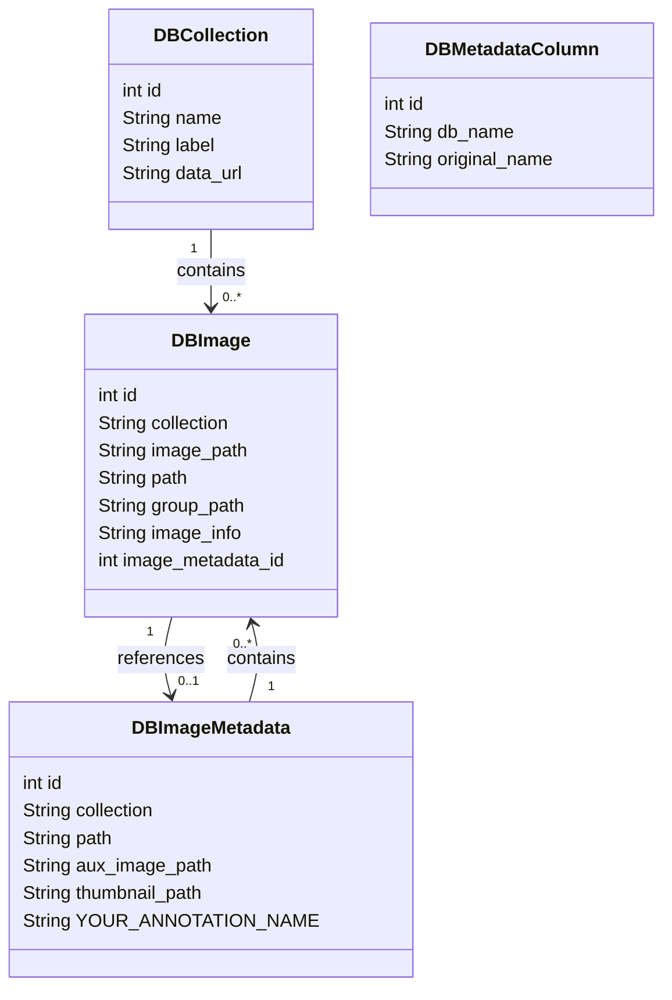
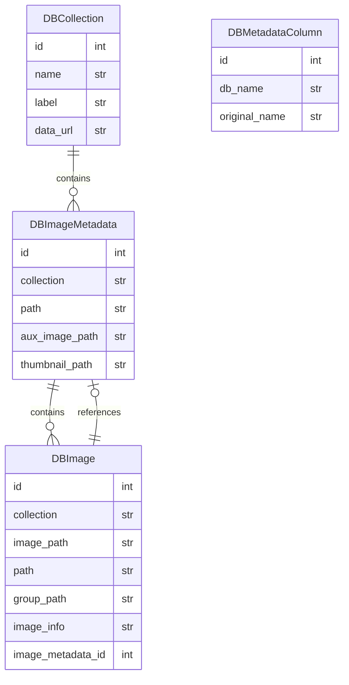

# Zarrcade Overview

## Data Model

Zarrcade uses a simple database schema to store the image metadata and annotations. A DBCollection is a named collection of images discovered at a particular URL. Images in the collection are added to the DBImage table. Annotations optionally loaded from the user-provided CSV file are added to the DBImageMetadata table, and each DBImage may be linked to a DBImageMetadata record. Columns in the CSV file are added to the DBMetadataColumn table which maps the original column name to the internal database name.

### Class diagram

### Entity-relationship (ER) diagram

