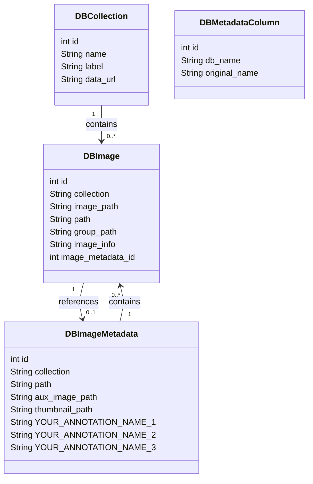
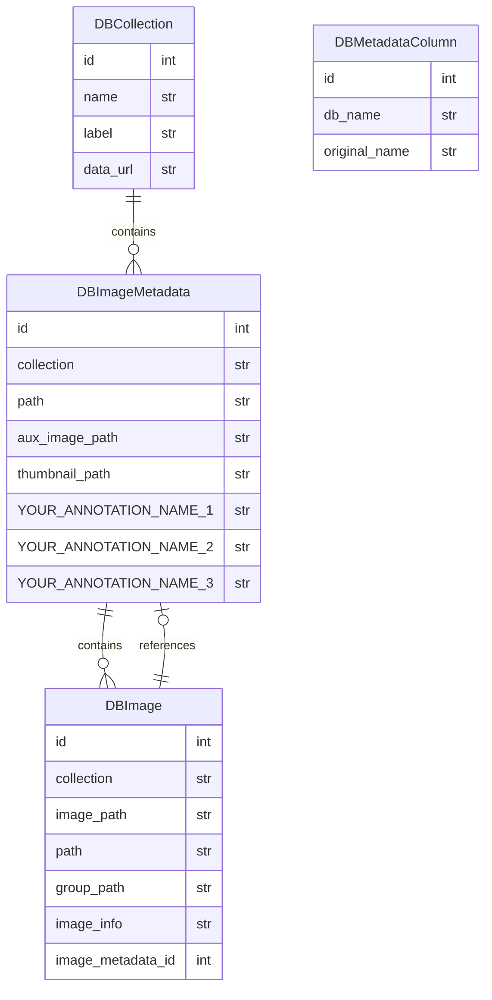

# Zarrcade Overview

## Image Discovery

Zarrcade supports automatic discovery of images through its [Agent](https://github.com/JaneliaSciComp/zarrcade/blob/main/zarrcade/agents/agent.py) API. An Agent is a Python class that implements the `walk` and `yield_images` methods, which is used to recursively search for images in a storage backend. 

Currently, there is only one built-in agent `OmeZarrAgent` which discovers [OME-Zarr](https://ngff.openmicroscopy.org/latest) images. It checks for the presence of a `.zattrs` file, and if found, it will attempt to recursively parse the OME-Zarr metadata in the container. If the `bioformats2raw.layout` attribute is found, the [transitional bioformats2raw layout](https://ngff.openmicroscopy.org/latest/#bf2raw) is used to extract images. Otherwise, the groups are checked recursively to find any group with a `multiscales` attribute. 

When [transitional Omero metadata](https://ngff.openmicroscopy.org/latest/#omero-md) is present, it is used to extract channels colors and intensity ranges, for use in e.g. Neuroglancer configuration.

## Neuroglancer Multichannel Configuration

Neuroglancer [does not currently support automatic loading of multichannel OME-Zarr images](https://github.com/google/neuroglancer/issues/541). To work around this, Zarrcade generates a Neuroglancer configuration JSON file and exposes it on its internal file server. When opening an image in Neuroglancer, the link will use the internal file server to load the configuration.

## Data Model

Zarrcade uses a simple database schema to store the image metadata and annotations. A *DBCollection* is a named collection of images at a particular URL or filepath. Images found at that data URL are discovered by `import.py` and added to the *DBImage* table. 

Annotations optionally loaded from the user-provided CSV file are added to the *DBImageMetadata* table, and each *DBImage* may be linked to one *DBImageMetadata* record. Multiple images (e.g. in an image series) may be linked to the same *DBImageMetadata* record. Columns in the CSV file are added to the *DBMetadataColumn* table which maps the original column name to the internal database name.

### Class diagram

This diagram shows the Python API for the database schema. These classes are mapped to the database tables using [SQLAlchemy](https://docs.sqlalchemy.org/en/20/orm/mapping_styles.html#declarative-mapping).

### Entity-relationship (ER) diagram

This diagram shows the database schema. You can use something like [DB Browser for SQLite](https://sqlitebrowser.org/) to browse your database file directly.

